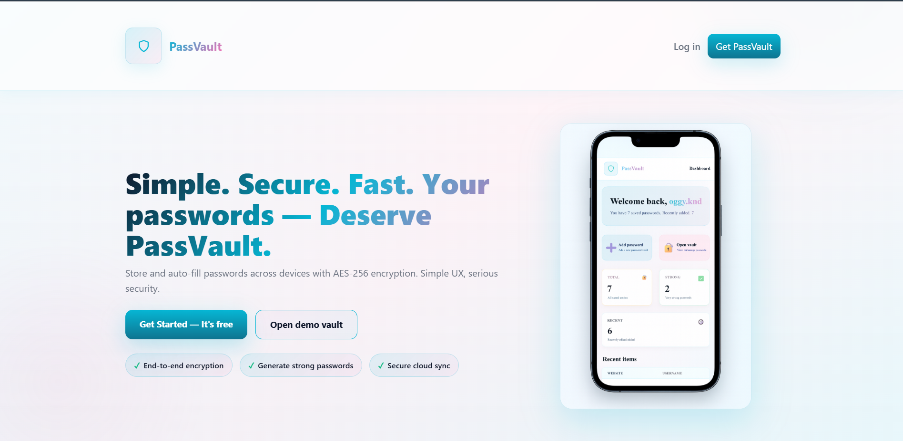
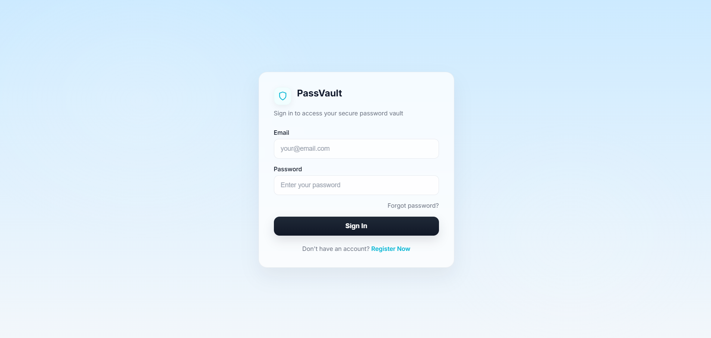
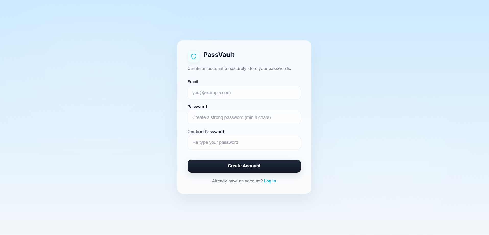
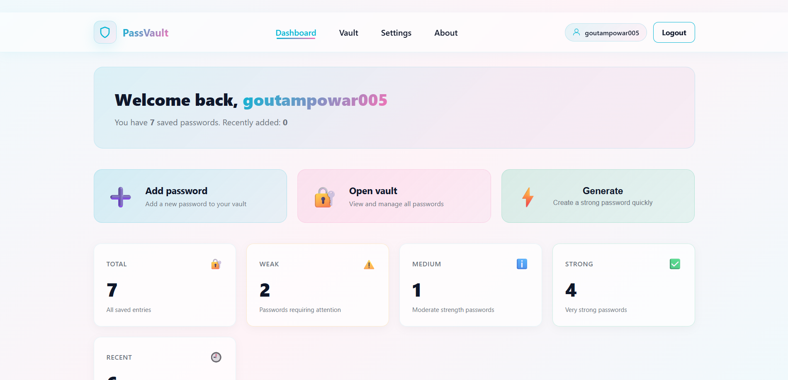
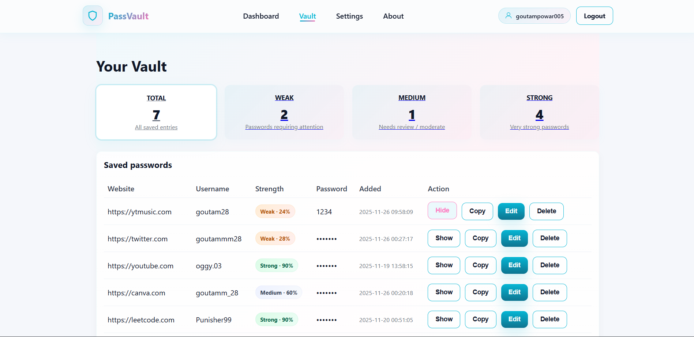
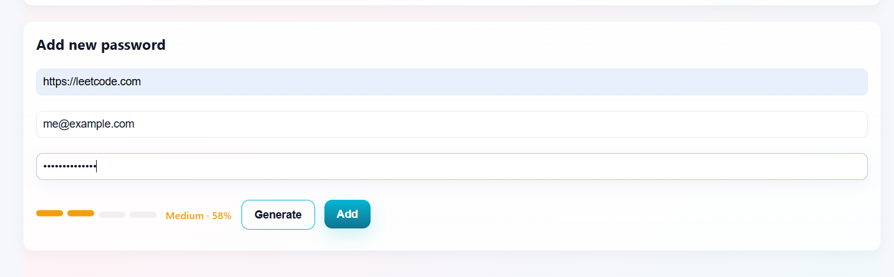
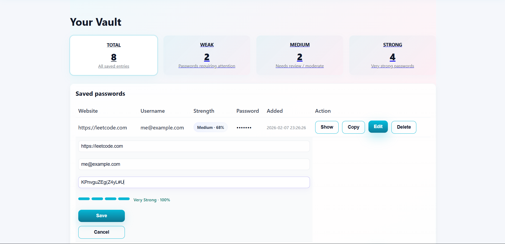
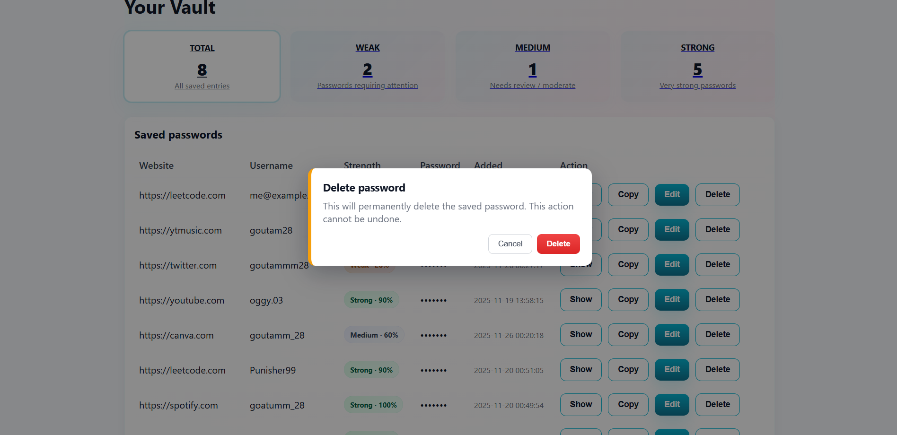

# PassVault 🔐

A simple PHP-based password manager built to understand authentication, secure data handling, and clean project structure.

---

## ✨ Features

- User authentication (register, login, logout)
- Secure session handling
- Password vault dashboard
- CRUD operations for password management
- Modular PHP structure using `includes/`
- Separation of sensitive configuration
- Clean UI with CSS & JavaScript assets

---

## 📸 Screenshots

### Home Page


_Landing page with overview of PassVault features_

### Login


_Secure user login interface_

### Register


_New user registration form_

### Dashboard


_User dashboard showing vault overview and statistics_

### Vault - View Passwords


_Password vault displaying all saved credentials_

### Vault - Add Password


_Form to add new password entries_

### Vault - Edit Password


_Interface to update existing password entries_

### Vault - Delete Password


_Confirmation dialog for deleting passwords_

---

## 🛠️ Tech Stack

- **Backend:** PHP (mysqli)
- **Frontend:** HTML, CSS, JavaScript
- **Database:** MySQL
- **Server:** Apache (XAMPP)
- **Version Control:** Git & GitHub

---

## 📁 Project Structure

```
passvault/
├── public/
│   ├── index.php
│   ├── login.php
│   ├── register.php
│   ├── dashboard.php
│   └── vault.php
│
├── includes/
│   ├── dbconn.php
│   └── header.php
│
├── assets/
│   ├── css/
│   └── js/
│
├── private/
│   └── dbconfig.php
│
├── sql/
│
├── screenshots/
│   ├── home.png
│   ├── login.png
│   ├── register.png
│   ├── dashboard.png
│   ├── vault-view.png
│   ├── vault-add.png
│   ├── vault-edit.png
│   └── vault-delete.png
│
├── .gitignore
└── README.md
```

---

## 🔒 Security Notes

- Database credentials are stored outside the public codebase
- The `private/` directory is ignored using `.gitignore`
- No secrets are committed to the repository
- Passwords should be hashed using bcrypt or similar algorithms
- Session management includes security best practices
- Input validation and sanitization implemented

---

## 🚀 Local Setup (XAMPP)

1. **Clone the repository:**

   ```bash
   git clone https://github.com/Powar-Goutxm/PassVault---Password-Manager.git
   cd PassVault---Password-Manager
   ```

2. **Move the project into XAMPP:**

   ```
   xampp/htdocs/passvault/
   ```

3. **Create MySQL database:**
   - Open phpMyAdmin (`http://localhost/phpmyadmin`)
   - Create a new database named: `passvault`
   - Import the SQL file from `sql/` directory

4. **Configure database credentials:**
   - Create `private/dbconfig.php` file
   - Add your database credentials (default XAMPP credentials shown):

   ```php
   <?php
   define('DB_HOST', 'localhost');
   define('DB_USER', 'root'); // Default username
   define('DB_PASS', '');  // Empty for default XAMPP
   define('DB_NAME', 'passvault');
   ?>
   ```

5. **Start servers:**
   - Open XAMPP Control Panel
   - Start Apache & MySQL

6. **Access the application:**
   ```
   http://localhost/passvault/
   ```

---

## 📊 Database Schema

The project uses the following main tables:

- `users` - Stores user account information
- `passwords` - Stores encrypted password entries
- Additional tables as needed for sessions and logging

---

## 🎯 Learning Objectives

This project demonstrates:

- ✅ PHP session management and authentication
- ✅ MySQL database design and queries
- ✅ Secure password handling
- ✅ CRUD operations implementation
- ✅ Modular PHP project structure
- ✅ Git version control practices
- ✅ Configuration management

---

## 🤝 Contributing

This is a learning project, but suggestions and improvements are welcome!

1. Fork the repository
2. Create your feature branch (`git checkout -b feature/AmazingFeature`)
3. Commit your changes (`git commit -m 'Add some AmazingFeature'`)
4. Push to the branch (`git push origin feature/AmazingFeature`)
5. Open a Pull Request

---

## 📄 License

This project is open source and available for educational purposes.

---

## 👨‍💻 Author

**Goutam Powar**

- GitHub: [@Powar-Goutxm](https://github.com/Powar-Goutxm)
- LinkedIn: [Goutam Powar](https://linkedin.com/in/goutam-powar)

---

## 🙏 Acknowledgments

- Built as a learning project to understand PHP authentication and security
- Inspired by modern password manager applications
- Thanks to the open-source community for various resources and tutorials

---

**⭐ If you found this project helpful, please give it a star!**
