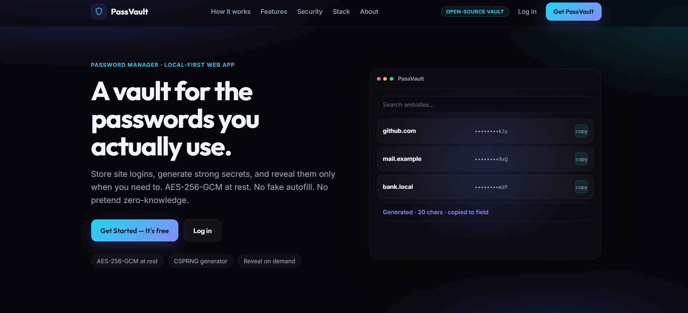
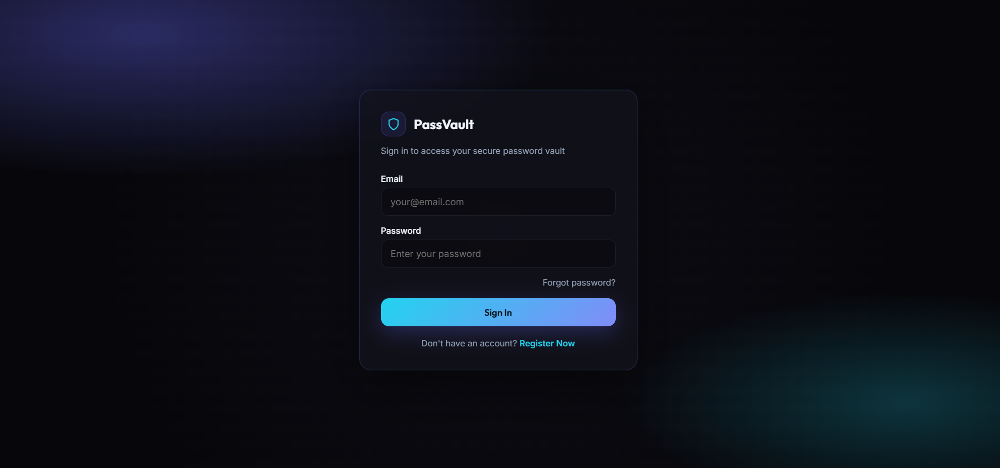
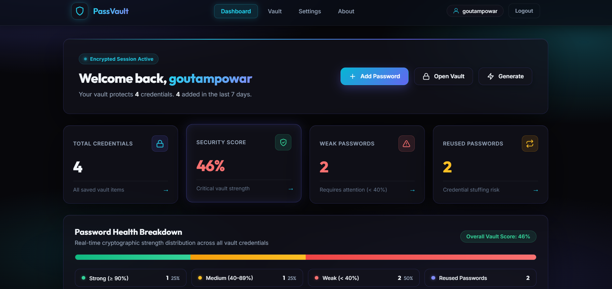
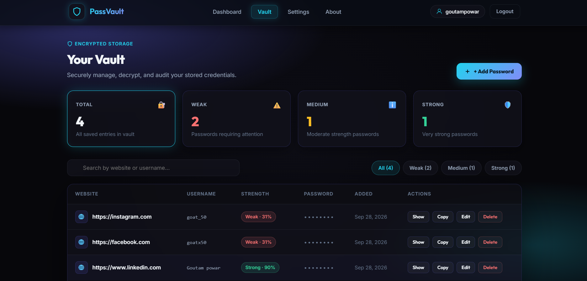

# PassVault 🔐

A modern, open-source web password manager built with **PHP**, **MySQL**, and a sleek **Deep Obsidian & Cyber Cyan** glassmorphism design system. Built with focus on real cryptographic primitives, defensive security controls, and responsive UI/UX.

---

## ✨ Highlights & Features

### 🎨 Modern Glassmorphism UI
- **Obsidian & Cyber Cyan Theme**: High-contrast, dark glass aesthetic (`#090d16` canvas, `#22d3ee` cyan, `#6366f1` indigo) with 12px backdrop blur.
- **Unified Experience**: Consistent typography (**Outfit** for headings, **Inter** for data/UI) across the marketing landing page, auth flows, and internal app shell.
- **Interactive Vault**: Client-side instant credential search, strength filter pills, and accessible dark frosted Add/Edit/Delete modals.
- **Integrated Password Tools**: Browser-based CSPRNG password generator and live visual strength analyzer.
- **Mobile Responsive**: Custom hamburger menu drawer with smooth transitions and full compliance with `@media (prefers-reduced-motion: reduce)`.

### 🛡️ Defensive Security & Cryptography
- **AES-256-GCM at Rest**: All stored credentials are encrypted using authenticated AES-256-GCM with a server-held master key.
- **On-Demand Decryption**: Ciphertext stays masked and is decrypted on the server only when an authenticated user requests a reveal or copy action via AJAX.
- **Hashed Logins**: Account passwords are independently hashed with `password_hash()` (Bcrypt/Argon2id) and never stored in plaintext.
- **CSRF Protection**: Cryptographically secure CSRF tokens required on all state-changing `POST` requests.
- **Rate Limiting**: Built-in throttling on failed login and password reset requests by IP to protect against brute-force attacks.
- **Secure Password Recovery**: Time-limited (30 min) reset tokens stored as SHA-256 hashes at rest with enumeration-resistant responses.
- **Session Hygiene**: Session regeneration on privilege escalation, `HttpOnly`, and secure cookie parameters.

---

## 📸 Screenshots

| Landing Page | Login |
| :---: | :---: |
|  |  |

| Dashboard | Vault |
| :---: | :---: |
|  |  |

---

## 🛠️ Tech Stack

- **Backend:** PHP 8.x (mysqli, OpenSSL)
- **Frontend:** Vanilla HTML5, CSS3 (CSS Variables, Flexbox/Grid, Glassmorphism), Vanilla JavaScript (ES6+)
- **Database:** MySQL 8.x / MariaDB
- **Server:** Apache (XAMPP) or Docker Compose
- **Typography:** Google Fonts (Outfit & Inter)

---

## 📁 Project Structure

```
passvault/
├── assets/
│   ├── css/
│   │   ├── auth.css           # Glassmorphism auth styling (login, register, reset)
│   │   ├── dashboard.css      # Dashboard KPI cards, health meter, activity stream
│   │   ├── header.css         # Modern frosted nav header and mobile drawer
│   │   ├── landing.css        # Hero, interactive mock, feature cards, footer
│   │   ├── style.css          # Legacy fallback styles
│   │   └── theme.css          # Core design tokens & color palette
│   └── js/
│       ├── header.js          # Mobile navigation toggle
│       ├── landing.js         # Scroll reveal animations & interactive hero mock
│       └── vault.js           # AJAX decryption, search filtering, modals, generator
├── includes/
│   ├── .htaccess              # Direct access restriction
│   ├── dbconn.php             # Database connection & AES-256-GCM encryption helpers
│   ├── header.php             # Logged-in application navigation bar
│   ├── marketing-nav.php      # Public marketing landing navigation
│   └── security.php           # Session security, CSRF protection, rate limiting, token helpers
├── private/
│   ├── .htaccess              # Denies all web access
│   ├── dbconfig.php           # Database credentials (gitignored)
│   └── secret.key             # Master AES-256 encryption key (gitignored)
├── public/
│   ├── about.php              # Public truth-bound about page
│   ├── dashboard.php          # Main dashboard view with KPI stats & health meter
│   ├── forgot-password.php    # Password recovery request flow
│   ├── index.php              # Landing page
│   ├── login.php              # Account authentication
│   ├── logout.php             # Secure session destruction
│   ├── register.php           # New user registration
│   ├── reset.php              # Token-verified password reset
│   ├── settings.php           # User account & password management
│   └── vault.php              # Credential management & CRUD modals
├── screenshots/               # Application preview screenshots
├── sql/
│   ├── schema.sql             # Base database schema
│   └── migrate_password_resets.sql # Password reset tokens schema
├── .gitignore
├── docker-compose.yml         # Containerized setup
├── Dockerfile                 # Container image specification
└── README.md
```

---

## 🚀 Local Setup (XAMPP)

### 1. Clone the repository
```bash
git clone https://github.com/Powar-Goutxm/PassVault---Password-Manager.git
cd PassVault---Password-Manager
```

### 2. Move to your XAMPP web root
Move or symlink the folder into `C:\xampp\htdocs\passvault`.

### 3. Setup the Database
1. Open phpMyAdmin (`http://localhost/phpmyadmin`) or your MySQL CLI.
2. Create a database named `passvault`:
   ```sql
   CREATE DATABASE passvault CHARACTER SET utf8mb4 COLLATE utf8mb4_unicode_ci;
   ```
3. Import the schemas located in `sql/`:
   - `sql/schema.sql`
   - `sql/migrate_password_resets.sql`

### 4. Configure Database Credentials
Create `private/dbconfig.php`:
```php
<?php
define('DB_HOST', 'localhost');
define('DB_USER', 'root');
define('DB_PASS', '');
define('DB_NAME', 'passvault');
```

Generate or place your 32-byte encryption key in `private/secret.key`:
```php
<?php
// You can generate a 32-byte random key once:
file_put_contents('private/secret.key', random_bytes(32));
```

### 5. Start Servers
Launch Apache and MySQL via the **XAMPP Control Panel** or run `C:\xampp\xampp_start.exe`.

### 6. Access the Application
Open your browser and navigate to:
```
http://localhost/passvault/public/index.php
```

---

## 🐳 Docker Setup (Alternative)

If you prefer running with Docker Compose:

```bash
docker compose up -d --build
```
The app will be available at `http://localhost:8080`.

---

## 🔒 Security Threat Model & Invariants

* **Server-Held Master Key**: PassVault encrypts vault credentials using AES-256-GCM with a server key (`private/secret.key`). It is a self-hosted web vault; it does not claim zero-knowledge client-side encryption.
* **Master Password Independence**: The user's login password is used solely for authentication and is hashed with `password_hash()`. Changing or resetting an account password does not require re-encrypting existing vault records.
* **Separation of Concerns**: Sensitive directories (`private/`, `includes/`) are locked down via Apache `.htaccess` rules and excluded from version control.

---

## 👨‍💻 Author

**Goutam Powar**
- GitHub: [@Powar-Goutxm](https://github.com/Powar-Goutxm)
- LinkedIn: [Goutam Powar](https://linkedin.com/in/goutam-powar)

---

## 📄 License

This project is open-source and available under the MIT License.
